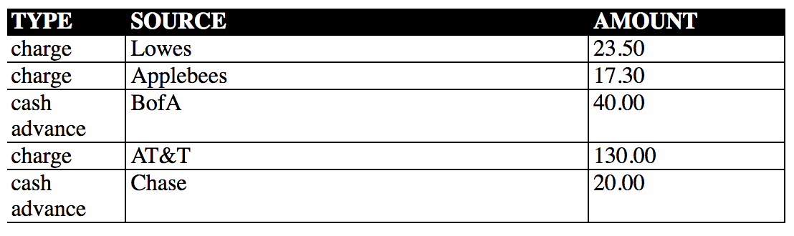
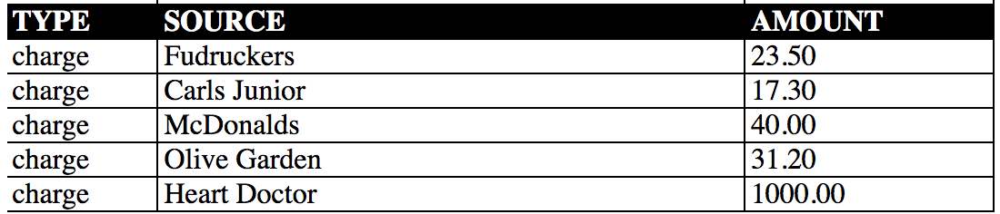

- populateRecords: given an array of objects,
  each contains a purchase record.  See example below for what it should look like
  - [
    -      { type: 'charge', source: 'Lowes', amount: '23.50'},
    -      { type: 'charge', source: 'Applebees', amount: '17.30'},
    -      { type: 'cash advance', source: 'BofA', amount: '40.00'},
    -      { type: 'charge', source: 'AT&T', amount: '130.00'},
    -      { type: 'cash advance', source: 'Chase', amount: '20.00'}
  -  ]
  -  
  - [
    -     { type: 'charge', source: 'Fudruckers', amount: '23.50'},
    -      { type: 'charge', source: 'Carls Junior', amount: '17.30'},
    -      { type: 'charge', source: 'McDonalds', amount: '40.00'},
    -      { type: 'charge', source: 'Olive Garden', amount: '31.20'},
    -      { type: 'charge', source: 'Heart Doctor', amount: '1000.00'}
    -    ]
  -  
  - Return an object with the total amount of charges 
  and the total amount charges and cash advances in an object, like this: 
  	- { charge: 27.50, 'cash advance': 40.10 }
  - Contain each section in an element with a class of "testOutput"
  - Convenient classes exist in the test.css file for you to use